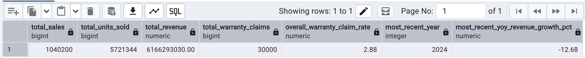
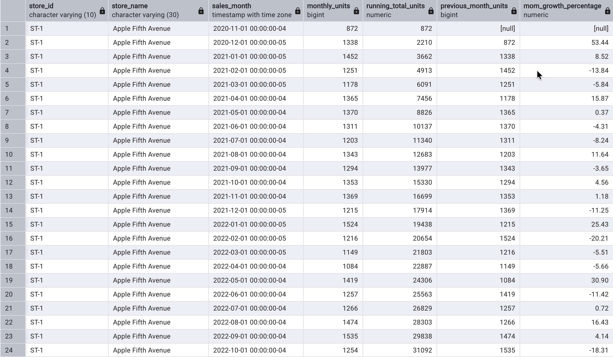
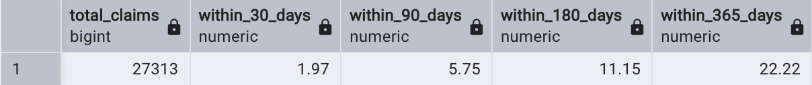
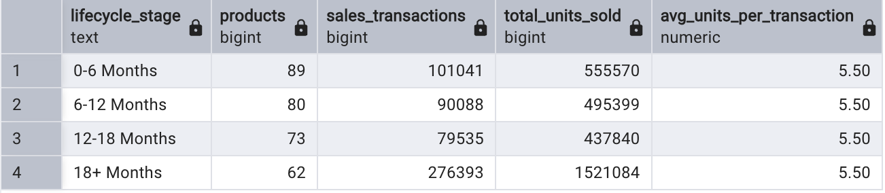
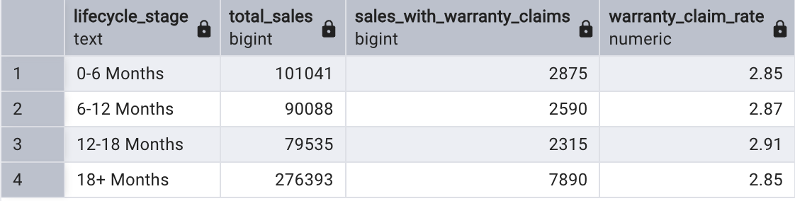

# Apple Retail Sales & Warranty Analytics


## Overview

This project analyzes **1 million+ Apple retail sales records** using PostgreSQL to uncover insights into store performance, product sales, pricing, sales trends, and warranty claims.

The project focuses on building a relational database, validating data quality, performing exploratory data analysis (EDA), solving business problems using SQL, and improving query performance for large datasets.

## Dataset

- **Source:** [Kaggle — Apple_Retail_Sales_Dataset](https://www.kaggle.com/datasets/amangarg08/apple-retail-sales-dataset)
- **Sales records:** 1,040,200 transactions / 5,721,344 total units sold
- **Time period:** Multiple years (through 2024)
- **Geographical coverage:** Multiple countries
- **Database:** PostgreSQL

The dataset contains information about stores, products, product categories, sales transactions, and warranty claims. It is a retail-style dataset used for SQL practice and is not official Apple sales data.

## Project Objectives

- Design and implement a relational PostgreSQL database
- Load and validate 1 million+ sales records
- Perform exploratory data analysis (EDA)
- Run data quality checks before trusting downstream analysis
- Analyze sales and product performance
- Investigate warranty claim behavior
- Apply advanced SQL techniques to solve business problems
- Improve query performance using indexing

## Database Schema

The project contains five related tables:

| Table | Description |
|---|---|
| `stores` | Store information including store name, city, and country |
| `category` | Product category information |
| `products` | Product details, categories, launch dates, and prices |
| `sales` | Sales transactions, stores, products, and units sold |
| `warranty` | Warranty claims, claim dates, and repair status |

### Table Relationships

```text
stores
   │
   └── sales ─── products ─── category
         │
         └── warranty
```

## How to Reproduce This Project

1. Create a PostgreSQL database, e.g. `apple_retail`.
2. Download the CSV files from the Kaggle dataset above and place them in a `dataset/` folder at the repository root.
3. From the repository root, run the scripts in order:

```bash
psql -U your_username -d apple_retail -f sql/schema.sql
psql -U your_username -d apple_retail -f sql/data_quality_checks.sql
psql -U your_username -d apple_retail -f sql/eda.sql
psql -U your_username -d apple_retail -f sql/business_analysis.sql
```

`schema.sql` creates the tables, loads the CSVs, and builds the indexes used by the later queries.

## Data Quality Checks

Before trusting any analysis, `data_quality_checks.sql` validates the dataset for:

- Duplicate primary keys
- Orphaned foreign keys (sales/warranty rows referencing non-existent stores, products, or sales)
- Invalid quantities (zero, negative, or NULL)
- Invalid prices (zero, negative, or NULL)
- Warranty claims dated before their corresponding sale
- Sales dated before a product's launch date
- Missing store or category fields
- Sale dates outside a plausible range (e.g. future-dated records)

Each check should return zero rows on a clean dataset; any rows returned flag a specific issue to investigate before proceeding to EDA or business analysis.

## Exploratory Data Analysis

`eda.sql` covers:

- Record counts across all tables
- Store distribution by country and city
- Product distribution by category
- Product price statistics
- Products launched by year
- Yearly sales volume
- Warranty claims by repair status

## Business Problems Solved

`business_analysis.sql` includes an overall KPI summary query plus **14 business questions** covering store performance, sales trends, product performance, pricing, and warranty analysis.

### Store & Sales Performance

1. **Top-performing stores by country** — Identify the top-performing store in each country based on total units sold, and rank all stores within their respective countries.
2. **Year-over-year store growth** — Analyze the year-over-year growth in units sold for each store and identify stores showing consistent growth or decline over time.
3. **Stores with higher warranty risk** — Identify stores with warranty claim rates significantly higher than the overall company-wide claim rate, and compare their sales volume against their warranty risk.
4. **Revenue contribution by category** — Determine the revenue contribution of each product category and identify which categories generate the largest share of total sales revenue.
5. **Top 3 products by country** — Identify the top three best-selling products in each country based on total units sold, and compare product performance across different markets.
6. **Sales and warranty performance by price range** — Segment products into price ranges and analyze how product pricing relates to sales volume and warranty claim frequency.
7. **Monthly store sales trends** — Calculate the monthly sales performance of each store over the last four years, including running totals and month-over-month growth rates.
8. **Best and worst sales months** — For each country and year, identify the best and worst-performing sales months based on total units sold.
9. **Above-average sales months** — Identify months that consistently generate above-average sales within each country and determine whether specific seasonal patterns exist across different markets.

### Warranty & Product Analysis

10. **Warranty claim timing** — Analyze the timing of warranty claims by calculating what percentage of claims are filed within 30, 90, 180, and 365 days after the original purchase.
11. **Highest warranty claim-rate products** — Identify the top 10 products with the highest warranty claim rates while applying a minimum sales-volume threshold (100+ sales) to avoid misleading results from low-volume products.
12. **Warranty risk by category** — Compare warranty claim rates across product categories.
13. **Product lifecycle sales analysis** — Analyze product sales trends over time, segmented into 0–6, 6–12, 12–18, and 18+ months since launch.
14. **Product lifecycle warranty risk** — Analyze warranty claim behavior across the same product lifecycle stages.

## Key Findings

- **Total revenue** across 1,040,200 sales transactions: **$6,166,293,030.00**
- **Overall warranty claim rate:** **2.88%** (30,000 claims across 1,040,200 sales)
- **Most recent year (2024) revenue growth:** **-12.68%** year-over-year
- **Warranty claim timing:** only **1.97%** of claims are filed within 30 days of purchase, but this climbs to **5.75%** within 90 days, **11.15%** within 180 days, and **22.22%** within a full year — claims accumulate steadily rather than clustering right after purchase.
- **Product lifecycle warranty risk:** claim rates are close across all stages (2.85%–2.91%), but **12-18 months after launch is the highest-risk window at 2.91%**, not the launch period itself — products don't show meaningfully more early-life defects in this dataset.
- **Product lifecycle sales:** the 18+ months stage accounts for the largest share of transactions and units sold (276,393 transactions / 1,521,084 units), which reflects the dataset's multi-year window giving older products more cumulative time on shelves rather than necessarily stronger per-product demand.
- **Top revenue-generating category:** the leading product category contributed **$953,443,623.00**, or **15.46%** of total revenue.
- **Best-performing market by units sold:** **Australia** led all countries in total units sold.

## Selected Query Results

### Q0 — Overall KPI Summary

A single-query snapshot of total revenue, total units sold, overall warranty claim rate, and most recent year's revenue growth.



### Q7 — Monthly Sales Trends

Calculate monthly sales performance for each store over the last four years, including running totals and month-over-month growth.



### Q10 — Warranty Claim Timing

Analyze how quickly warranty claims are filed after a purchase and calculate the percentage of claims filed within different time periods.



### Q13 — Product Lifecycle Sales

Analyze product sales performance across different stages of the product lifecycle: 0–6, 6–12, 12–18, and 18+ months.



### Q14 — Product Lifecycle Warranty Risk

Analyze whether warranty claim behavior changes depending on how long a product has been on the market.



## SQL Techniques Used

- `JOIN` (inner, left, cross)
- `GROUP BY` / `HAVING`
- Aggregate functions
- `CASE` statements
- Subqueries and correlated subqueries
- Common Table Expressions (CTEs), including multi-CTE chains
- Window functions: `RANK()`, `ROW_NUMBER()`, `LAG()`, running totals via `SUM() OVER()`
- Year-over-year and month-over-month growth calculations
- Date/interval calculations and filtering
- Conditional aggregation (`FILTER`)
- Data segmentation (price tiers, lifecycle stages)
- Revenue and warranty-rate calculations
- Data validation queries (duplicates, orphaned keys, invalid values, out-of-range dates)

## Performance Optimization

Because the dataset contains **1 million+ sales records**, query performance was considered as part of the project.

`schema.sql` creates indexes on the columns most frequently used in joins and filters:

- `sales(product_id)`
- `sales(store_id)`
- `sales(sale_date)`
- `warranty(sale_id)`
- `warranty(claim_date)`

Query execution plans were evaluated using PostgreSQL's `EXPLAIN ANALYZE` — see the example at the bottom of `schema.sql`, which compares planner behavior on a representative filtered/grouped query before and after indexing.

## Project Structure

```text
apple-retail-sales-sql-analysis/
│
├── dataset/
│   ├── stores.csv
│   ├── category.csv
│   ├── products.csv
│   ├── sales.csv
│   └── warranty.csv
│
├── sql/
│   ├── schema.sql
│   ├── data_quality_checks.sql
│   ├── eda.sql
│   └── business_analysis.sql
│
├── screenshots/
│   ├── project_banner.png
│   ├── q0_result.png
│   ├── q7_result.png
│   ├── q10_result.png
│   ├── q13_result.png
│   └── q14_result.png
│
└── README.md
```

## Known Limitations

- **Revenue calculations use current catalog price**, not a historical price-at-time-of-sale value, since the dataset has no price-history table. Revenue trends should be read as directional, not exact.
- **Monthly trend queries (Q7) do not synthesize zero-sales months** — a store/month combination with no sales simply has no row, so month-over-month growth after a gap reflects the jump from the last active month rather than a true 0% baseline.
- This is a third-party retail-style dataset intended for SQL practice, not official Apple sales figures.

## Key Takeaways

This project demonstrates how SQL can be used beyond basic querying to validate data quality and perform practical business analysis on a large retail dataset — covering:

- Data validation before analysis (duplicates, orphaned keys, invalid values)
- Store performance across different markets
- Product sales and revenue contribution
- Sales growth and seasonal patterns
- Product pricing and sales performance
- Warranty claim behavior and timing
- Product lifecycle performance
- Query optimization for large datasets

The complete SQL for schema setup, data validation, EDA, and all 14 business problems is available in the [`sql`](sql/) directory.
